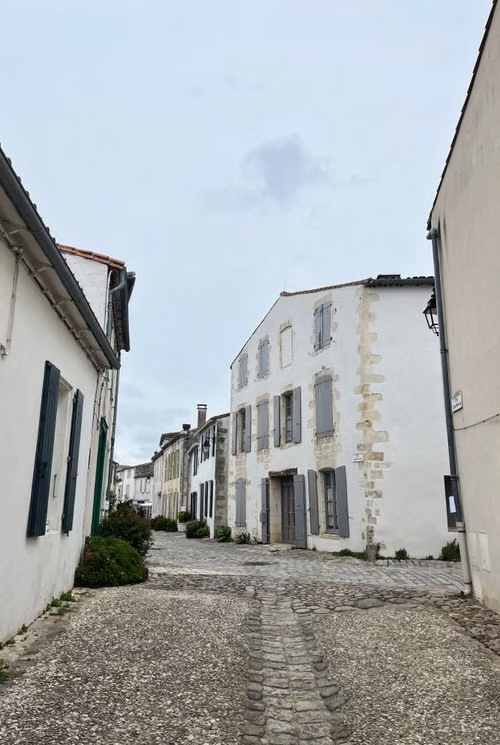

# Chapitre 5 — Les attributs, les liens et les images

## Objectif

Comprendre qu’un attribut **configure** un élément, puis utiliser `a` (lien) et `img` (image).

## Qu’est-ce qu’un attribut ?

Un attribut s’écrit **toujours dans la balise ouvrante** :

```html
nom="valeur"
```

```html
<p title="Fiche du vendeur">Karim — Alger</p>
```

`title` est un attribut universel. Au survol, le navigateur montre une **infobulle** (tooltip).

## L’élément `a` — le lien (hyperlien)

`a` = *anchor*. `href` = *hypertext reference* = **destination**.

```html
<a href="https://www.google.com">Aller sur Google</a>
```

Sans `href`, le lien ne mène nulle part.

### Ouvrir dans un nouvel onglet

Par défaut, le lien remplace la page actuelle. Pour un nouvel onglet :

```html
<a href="https://www.google.com" target="_blank">Google (nouvel onglet)</a>
```

`target="_blank"` = ouvrir ailleurs, garder le site ouvert.

## L’élément `img` — l’image

`img` est un **élément vide**. Deux attributs essentiels :

| Attribut | Rôle |
|---|---|
| `src` | chemin ou URL de l’image |
| `alt` | texte si l’image ne charge pas + accessibilité |

Autres attributs utiles : `title`, `width`, `height`, `class`, `id`.

```html

```

## Exemple réel : menu + photo d’annonce

```html
<p title="Menu du site">
  <a href="index.html">Accueil</a> |
  <a href="https://www.google.com" target="_blank">Recherche</a>
</p>


```

## Place de l’attribut

Toujours **dans la balise ouvrante**, jamais dans la fermante, jamais entre les deux.

```html
<!-- correct -->
<a href="page.html">texte</a>

<!-- incorrect -->
<a>href="page.html" texte</a>
```

## À retenir

- Attribut = `nom="valeur"` dans la balise ouvrante.
- `a` + `href` = lien ; `target="_blank"` = nouvel onglet.
- `img` + `src` + `alt` = image.
- `title` = infobulle au survol.
